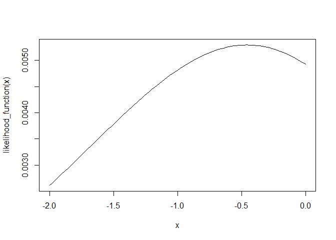

<!-- README.md is generated from README.Rmd. Please edit that file -->

# ERPM

<!-- badges: start -->
<!-- badges: end -->

ERPM is the software implementation of the statistical model outlined
in:

Hoffman, M., Block, P., & Snijders, T. A. (2023). Modeling partitions of
individuals. Sociological Methodology, 53(1), 1-41.

[Link to the study in Sociological
Methodology](https://journals.sagepub.com/doi/full/10.1177/00811750221145166?casa_token=Tytya_Og5sIAAAAA%3Atod8D6uVR3Fhc66fNapyJtV3J2Lw5u0DfZo3YJKFfnOOFSNHF6r6IvcK74s-4M0yVSoZI2hKm2ZvKJ4).

The model allows for the analysis of emergent group compositions in
partitions, i.e., sets of non-overlapping groups. For a given partition
of individuals (or nodes, to follow the language of network analysis),
we can use this model to understand group formation processes that led
to the observation of this partition, based on individual attributes,
relations between individuals, and size-related factors. It can be seen
as an extension of Exponential Random Graph Models (ERGMs) to the case
of partition objects. With this package, one can either simulate this
model or estimate its parameters for a given dataset.

This package also provides a longitudinal extension of the model, for a
list of partitions, where each partition depends on the previous
partitions. It follows the definition proposed in:

Hoffman, M., & Chabot, T. (2023). The role of selection in socioeconomic
homophily: Evidence from an adolescent summer camp. Social Networks, 74,
259-274.

The **ERPM Manual** is available here on github in the documentation
folder.

# Note from the developers

The package and the documentation might still have bugs or errors, or
you might not be able to do what you want. In that case, or if you are
unsure please create an issue here or directly send an email to the
package maintainer (marion.hoffman\[at\]iast.fr).

We are currently (Mar 2024) on version 0.1.0 on github.

# Installation

You can install ERPM either from GitHub or from CRAN.

``` r
# from GitHub:
# install.packages("remotes")
remotes::install_github("stocnet/ERPM")
```

``` r
# from CRAN:
install.packages("ERPM")
```

# Cross-sectional example

In this section, we outline a simple example with synthetic data.

``` r
library(erpm)
```

## The Data

Let us define a set of n = 6 nodes with three attributes (label, gender,
and age), and an arbitrary covariate matrix (friendship). We create the
following dataframe.

``` r
n <- 6 
nodes <- data.frame(label = c("A","B","C","D","E","F"),
                    gender = c(1,1,2,1,2,2),
                    age = c(20,22,25,30,30,31)) 
friendship <- matrix(c(0, 1, 1, 1, 0, 0,
                       1, 0, 0, 0, 1, 0,
                       1, 0, 0, 0, 1, 0,
                       1, 0, 0, 0, 0, 0,
                       0, 1, 1, 0, 0, 1,
                       0, 0, 0, 0, 1, 0), 6, 6, TRUE) 
```

We consider a partition for these 6 individuals. We define a vector with
six elements, indicating the id of each individual’s group.

``` r
partition <- c(1,1,2,2,2,3)
```

## Model specification

First, we need to choose the effects (i.e., explaining variables) we
want to include. For example we set four (which is of course not
reasonable for 6 nodes): 1. “num_groups”: tendency to form more groups
2. “same” (for the gender covariate): tendency to form groups with
individuals with the same gender 3. “diff” (for the age covariate):
tendency to form groups with individuals with high age differences 4.
“tie” (for the friendship covariate): tendency to form groups with
friends

``` r
effects <- list(names = c("num_groups","same","diff","tie"),
                objects = c("partition","gender","age","friendship"))
objects <- list()
objects[[1]] <- list(name = "friendship", object = friendship)
```

The effect objects should contain names of pre-written functions in the
package (see manual for all effect names) as well as objects they are
referring to (either the partition, or covariates). When objects are not
individual covariates, we need to create an additional list to store
these extra objects.

## Estimation

The parameters of the model can be estimated using Maximum-likelihood
estimation (equivalent to the Method of Moment estimation). For more
details on the parametrization of the estimation algorithm, see the
manual.

``` r
estimation <- estimate_ERPM(partition, 
                          nodes, 
                          objects, 
                          effects, 
                          startingestimates = c(-1.5,0.2,-0.2,0.2), 
                          burnin = 100, 
                          thining = 20,
                          length.p1 = 500, # number of samples in phase 1
                          multiplication.iter.p2 = 20,  # multiplication factor for the number of iteration in phase 2 subphases 
                          num.steps.p2 = 4, # number of phase 2 subphases
                          length.p3 = 1000) # number of samples in phase 3
#> [1] "Observed statistics"
#> [1]  3  2 12  2
#> [1] "Burn-in"
#> [1] 100
#> [1] "Thining"
#> [1] 20
#> [1] "Autocorrelations in phase 1:"
#> [1]  0.190565257 -0.006299076  0.035853739  0.081341896
#> [1] "Covariance matrix"
#>            [,1]       [,2]      [,3]       [,4]
#> [1,]  0.4853347 -0.3405731 -2.051499 -0.4277876
#> [2,] -0.3405731  0.9459679  2.798986  0.5723407
#> [3,] -2.0514990  2.7989860 48.327900  2.1282044
#> [4,] -0.4277876  0.5723407  2.128204  0.7422004
#> [1] "Invert scaling matrix"
#>            [,1]        [,2]        [,3]        [,4]
#> [1,] 3.23944720  0.19702805  0.05716033  1.24104403
#> [2,] 0.19702805  1.59505391 -0.03889049 -0.80394587
#> [3,] 0.05716033 -0.03889049  0.02465366 -0.00620526
#> [4,] 1.24104403 -0.80394587 -0.00620526  2.42979142
#> [1] "Estimated statistics after phase 1"
#> [1]  3.194  1.618 10.234  1.778
#> [1] "Estimates after phase 1"
#>            [,1]
#> [1,] -1.6767311
#> [2,]  0.5239306
#> [3,] -0.1837845
#> [4,]  0.1805853
#> Difference to estimated statistics after phase 2, step 1NULL
#> [1] -0.04347826  0.08695652  1.56521739 -0.04347826
#> Estimates after phase 2, step 1NULL
#>                
#> [1,] -1.6620124
#> [2,]  0.5974753
#> [3,] -0.1962869
#> [4,]  0.2409776
#> Difference to estimated statistics after phase 2, step 2NULL
#> [1] -0.05769231  0.15384615  1.05769231  0.11538462
#> Estimates after phase 2, step 2NULL
#>                
#> [1,] -1.7645854
#> [2,]  0.4750252
#> [3,] -0.2196759
#> [4,]  0.0832029
#> Difference to estimated statistics after phase 2, step 3NULL
#> [1]  0.02255639 -0.02255639 -0.13533835 -0.03759398
#> Estimates after phase 2, step 3NULL
#>                
#> [1,] -1.8125527
#> [2,]  0.4121316
#> [3,] -0.2073120
#> [4,]  0.1097652
#> Difference to estimated statistics after phase 2, step 4NULL
#> [1]  0.00621118 -0.02173913  0.03416149 -0.02173913
#> Estimates after phase 2, step 4NULL
#>                
#> [1,] -1.6417282
#> [2,]  0.3471364
#> [3,] -0.2000850
#> [4,]  0.2616871
#> [1] "Autocorrelations in phase 3:"
#> [1]  0.13367389  0.06854042 -0.03217365  0.06924863
#> [1] "Estimated statistics after phase 3"
#> [1]  3.049  1.847 11.568  1.891
#> [1] "Estimates after phase 3"
#>                
#> [1,] -1.6417282
#> [2,]  0.3471364
#> [3,] -0.2000850
#> [4,]  0.2616871
#>       effect     object        est   std.err sig          t        conv
#> 1 num_groups  partition -1.6417282 2.0677663     -0.7939622  0.07079343
#> 2       same     gender  0.3471364 1.3761982      0.2522430 -0.14465476
#> 3       diff        age -0.2000850 0.1532539     -1.3055782 -0.05669925
#> 4        tie friendship  0.2616871 1.8028522      0.1451517 -0.11864920
estimation$results
#>       effect     object        est   std.err        conv
#> 1 num_groups  partition -1.6417282 2.0677663  0.07079343
#> 2       same     gender  0.3471364 1.3761982 -0.14465476
#> 3       diff        age -0.2000850 0.1532539 -0.05669925
#> 4        tie friendship  0.2616871 1.8028522 -0.11864920
```

### Simulation

We can check how the model reproduces statistics of the observed data by
simulating the estimated model. We can also use this function to
simulate theoretical models.

``` r
nsimulations <- 1000
simulations <- draw_Metropolis_single(theta = estimation$results$est, 
                          first.partition = partition, 
                          nodes = nodes, 
                          effects = effects, 
                          objects = objects, 
                          burnin = 100, 
                          thining = 20, 
                          num.steps = nsimulations, 
                          neighborhood = c(1,1,1), 
                          sizes.allowed = 1:n,
                          sizes.simulated = 1:n,
                          return.all.partitions = T)
```

### Log-likelihood and AIC

Finally, we can estimate the log-likelihood and AIC of the model (useful
to compare two models for example). First we need to estimate the ML
estimates of a simple model with only one parameter for number of groups
(this parameter should be in the model!).

``` r
likelihood_function <- function(x){ exp(x*max(partition)) / compute_numgroups_denominator(n,x)}
curve(likelihood_function, from=-2, to=0)
```



``` r
parameter_base <- optimize(likelihood_function, interval=c(-2, 0), maximum=TRUE)
parameters_basemodel <- c(parameter_base$maximum,0,0,0)
```

Then we can get our estimated logL and AIC.

``` r
logL_AIC <- estimate_logL(partition,
                         nodes,
                         effects, 
                         objects,
                         theta = estimation$results$est,
                         theta_0 = parameters_basemodel,
                         M = 3,
                         num.steps = 200,
                         burnin = 100,
                         thining = 20)
#> [1] "step 1"
#> [1] "step 2"
#> [1] "step 3"
logL_AIC$logL
#>           [,1]
#> [1,] -4.384881
logL_AIC$AIC
#>           [,1]
#> [1,] 0.7697621
```

# More …

For more details on the longitudinal version of the model or other
functions, have a look at the manual in the documentation folder or the
example script in the scripts folder.
